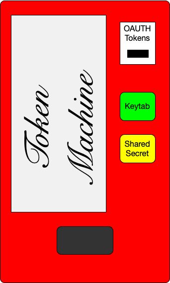

# TokenMachine

Insert OAUTH Token, take out Kerberos Keytabs or Shared Secret.



## TL; DR

Grants shared secrets (SharedSecret) and Kerberos Keytabs (Keytab) to bearers of authorized OAUTH tokens using the Open Policy Agent (OPA) Rego language. Distributed operation and replay attack prevention are also implemented.

## Use Case

All use cases require that you have an Identity Provider (IDP) capable of providing your applications with an OAUTH token and that the public key is accessible via https by following the issuer (iss) in the token.

1. You have an application that uses Kerberos Keytabs to obtain Kerberos tickets which are then used to access resources such as a Windows SMB filesystem. You are concered about security specifically the Keytab escaping from the authorized application.

1. You have an distributed application that uses shared secrets. You are concerned about the shared secret escaping outside of the distributed application.

## Types

### Keytab

A Kerberos Keytabs is a file that contains one or more credential pairs. A credential pair is a principal and encrypted password. The password is encrypted by the Kerberos controller with a domain secret. In practice most Keytabs hold a single principal. Currenly TokenMachine only supports one principal per Keytab. The **Keytab** type has a name, principal, expiration (exp) and a Kerberos Keytab (base64File). The  name is assigned by the administrator and may or may not be the same as the principal.  The principal is the domain user + the domain name. The expiration (exp) is the time in UNIX epoch seconds when the Keytab will no longer be valid. Finally the base64File is the aforementioned Keytab file encoded in a Base64 string.

```json
{
  "name": "user",
  "exp": 1604948339,
  "principal": "user@EXAMPLE.COM",
  "base64File": "base 64 encoded file"
}
```

### SharedSecret

The **SharedSecret** type holds a name, secret and expiration (exp). If may also contain a nextSecret and nextExp. The name is assigned by the administrator. The secret is self explanatory. The expiration (exp) is the time in UNIX epoch seconds when the SharedSecret will no longer be valid. If the half life of the secret has been reached the fields nextSecret and nextExp will be present. These are the values of secret and expiration (exp) in the next period.

```json
{
  "name": "this",
  "secret": "the secret",
  "exp": 1604948339,
  "nextSecret": "the next secret",
  "nextExp": 1604948939
}

```
### Resiliency / Redundancy

Resiliency or redundancy can be achieved by running more than one instance of the Tokenmachine server. This should work without conflict as long as the seeds for each entity are the same. Once again the seeds must remain secret.

### Replay Attack Prevention

TokenMachine provides nonces to authroized bearer token holders. The bearer can then obtain a new token with the nonce encapsulated inside the new token. The OPA/Rego policy can be used to verify the presence of the nonce in the token claims. For example the nonce may be held in the audience (aud) field. The OPA/Rego policy allows flexibility on the placement of this token.


### Operation

Operationally the process works like this. Client is the user or machine that desires a SharedSecret or Keytab, Server is this (the TokenMachine) and Identity Provider (IDP) is the provider of tokens (outside our concern).

1. The Client obtains a token from their IDP
1. The Client uses the token to request a Nonce from the Server
1. The Server validates that the Client is authorized and returns a Nonce to the Client
1. The Client obtains a new token from their IDP with the Nonce value encoded somewhere in the token (such as audience)
1. The client request a SharedSecret or Keytab with the new token from the Server
1. The Server authorizes the request by checking to see if the Client is entitled to the requested entity and that a valid Nonce is present in the token

The authorization process for entitlement and nonce is done with an operator provided OPA/Rego policy.

### Redundancy

Can be achieved by running discrete instances of the TokenMachine server. This is possible because the SharedSecret secret and Keytab principal password are derived from a seed. If the configuration is the same on discrete instances and the clock is synchronized then-secret or password will be the same.


## Installation

Tokenmachine is supported on Windows, Linux, and Darwin. Keytabs can only be provided when running on a Windows server that is either a Domain Controller or is part of a Domain. For Linux and Darwin, only dummy Keytabs will be provided.

### Windows

For Windows, it is intended to run the server as a Windows service. The binary can install itself as a service and even start itself. Installation consists of placing the binary in a desired location, setting the config(s), installing the service, and finally starting the service. The service must be configured to run as a Directory Admin (this is required for the creation of keytabs). The config (covered in the configuration section) is one or more YAML, JSON, or OPA/Rego files or URLs.

Create a directory for the binary

```bash
mkdir "C:\Program Files\TokenMachine"
```

Change directory to "C:\Program Files\TokenMachine" and download the binary into this directory. Then install the windows service and create an example config with the following commands.

```bash
.\tokenmachine.exe service install
.\tokenmachine.exe config example > config.yaml
```

You will need to edit the file config.yaml. See Here.

Now set the config file location with the command

```bash
.\tokenmachine.exe service config set "C:\Program Files\TokenMachine\config.yaml"
```

Note that you may specify more than one file by separating the entries with a comma. For example

```bash
.\tokenmachine.exe service config set "C:\Program Files\TokenMachine\config.yaml,C:\other.yaml,https://github.com/myrepo/config.yaml"
```

It is a good idea to keep the file or files containing sensitive data such as seeds in a separate file and give it restrictive permissions.

When you are ready you can start the service with the command

```bash
.\tokenmachine.exe service start
```

### Linux and Darwin

For Linux and Darwin download and install the binary tokenmachine. Note that valid Keytabs will NOT be issued on Linux and Darwin.

Create an example config with the command

```bash
./tokenmachine config example > example.yaml
```

Run the server with the command

```bash
./tokenmachine --config example.yaml
```

## Example

[Config](example/config)

[Clients](example/clients)

## Misc

TokenMachine uses [LibTokenMachine](https://github.com/jodydadescott/libtokenmachine)
